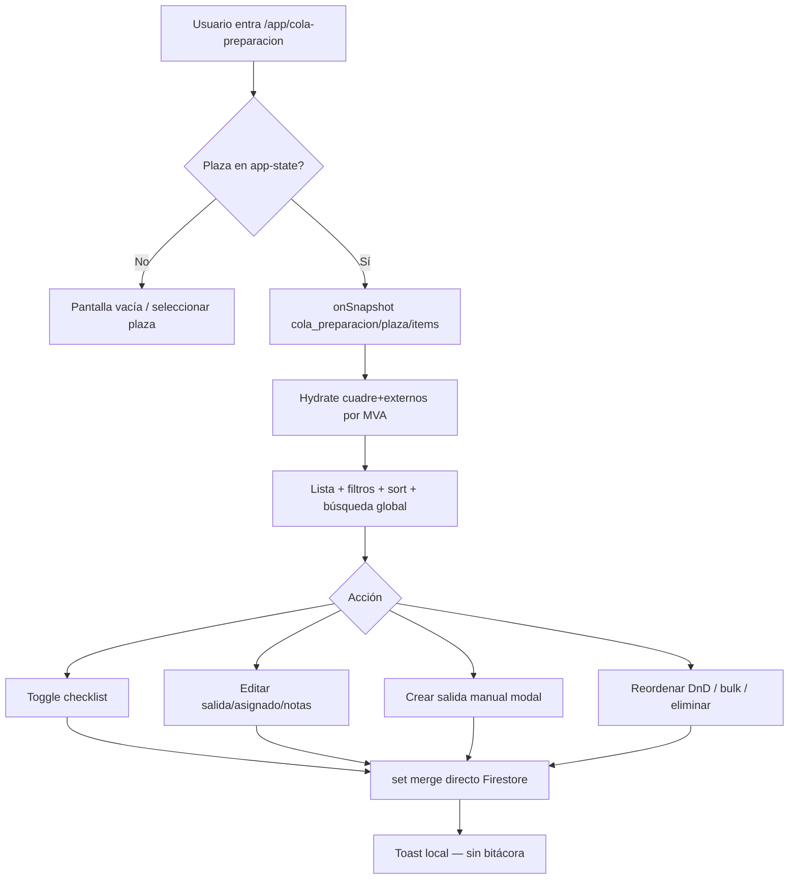
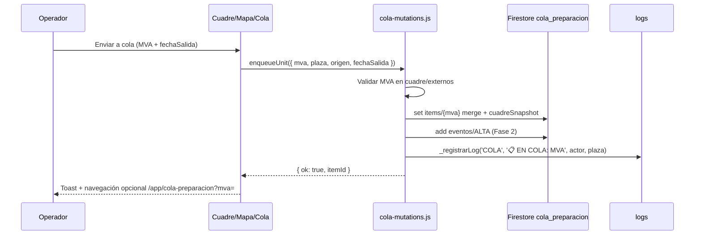
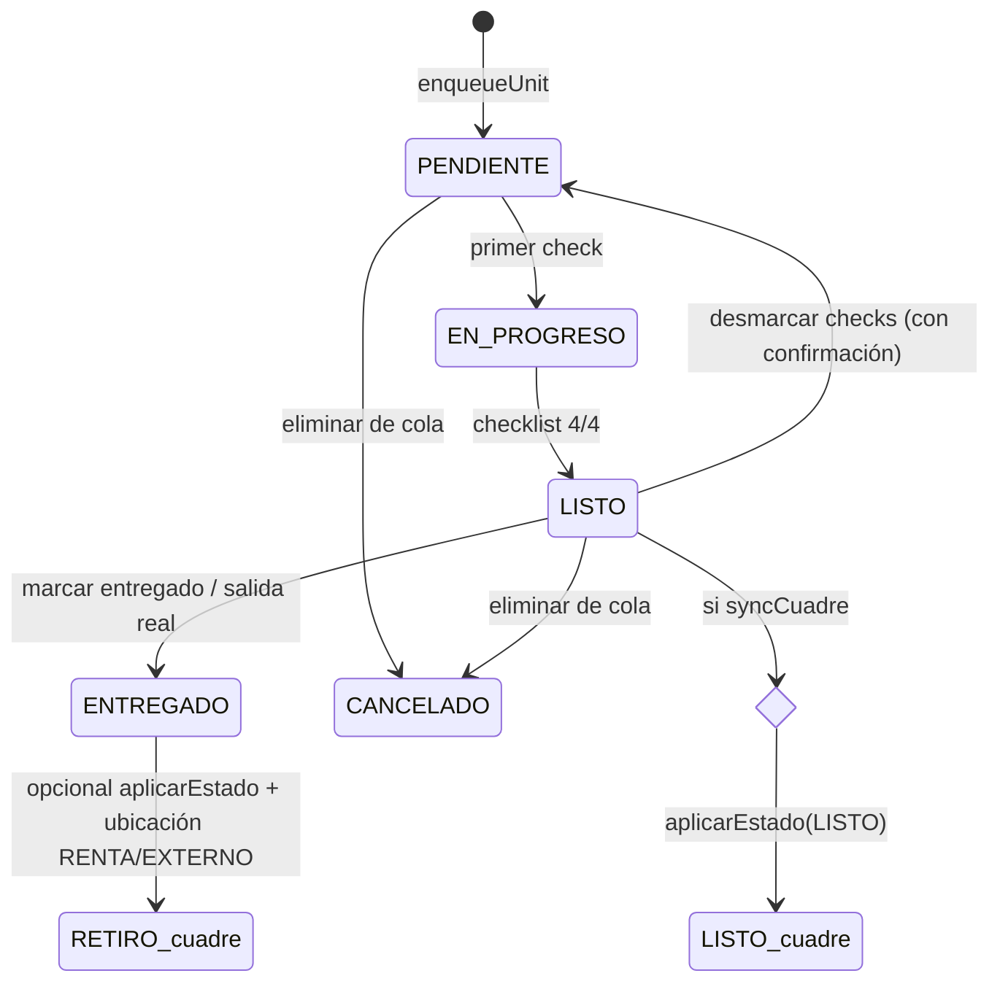
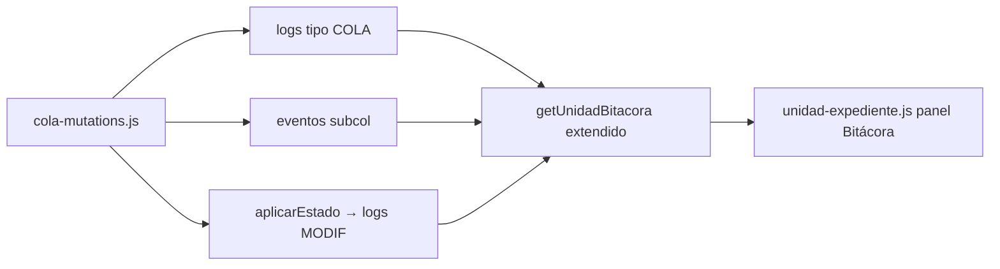

# Plan de mejora: Cola de preparación integrada con Cuadre

> **Versión:** 2026-07-15  
> **Alcance:** planificación — sin implementación  
> **Audiencia:** desarrolladores del repo mex-mapa

---

## 1. Estado actual

### 1.1 Arquitectura

La Cola de preparación es un módulo **semi-migrado** al App Shell: la ruta canónica es `/app/cola-preparacion`, pero convive con la página legacy standalone y **no tiene capa API ni carpeta `js/app/features/`** (a diferencia de incidencias o cuadre-data).

| Capa | Archivo(s) | Rol |
|------|-----------|-----|
| **Vista SPA (activa)** | `js/app/views/cola-preparacion.js` | `mount`/`unmount`, UI completa, Firestore directo |
| **Vista legacy** | `cola-preparacion.html`, `js/views/cola-preparacion.js` | Misma lógica duplicada (~1080 líneas) |
| **Estilos** | `css/cola-preparacion.css` | Compartido SPA + legacy |
| **Router** | `js/app/router.js` L119 | `loader: cola-preparacion.js`, `feature: cola_preparacion` |
| **Route resolver** | `js/app/route-resolver.js` L51-59 | `shellIntegrated: true`, `fullModuleMigrated: true` |
| **Redirect** | `js/views/legacy-shell-bridge.js` | `/cola-preparacion` → `/app/cola-preparacion` |
| **Navegación** | `js/shell/navigation.config.js` L86-88 | Feature gate `cola_preparacion` |
| **Dashboard** | `js/app/views/dashboard.js` L396-414, L632-644 | Widget preview (5 items, sin deep link) |
| **Cuadre legacy** | `js/views/cuadre.js` L23-26, L124-137 | Botón "Cola" → `/cola-preparacion?plaza=` |
| **Mapa (stub)** | `js/app/features/mapa/mapa-unit-actions.js` L58-63, L386-388 | `send_to_preparacion` **bloqueada** (`NO_SAFE_API`) |

**Nota:** `/app/cuadre` sigue siendo **legacy-stage** (iframe a `cuadre.html` → `mapa?fleet=1`), no una vista SPA nativa (`js/app/router.js` L130).

### 1.2 Modelo Firestore actual

```
cola_preparacion/{plaza}/items/{itemId}
```

- **ID del documento:** típicamente el MVA (mayúsculas).
- **Campos en uso** (normalizados en `_normalizeQueueItem`, SPA L81-96):
  - `mva`, `fechaSalida`, `checklist.{lavado,gasolina,docs,revision}`
  - `asignado`, `notas`, `orden`
  - `creadoAt`/`creadoEn`, `actualizadoAt`, `creadoPor`, `actualizadoPor`

**Reglas:** `firestore.rules` L960-966 — lectura/escritura si `plazaAutorizada(plaza)`.

**No está en `COL`:** `js/core/database.js` no define constante para `cola_preparacion`; las vistas usan string literal.

### 1.3 Enriquecimiento con Cuadre (solo lectura)

Ambas vistas hidratan metadata de unidad consultando en paralelo:

- `COL.CUADRE` + `COL.EXTERNOS` por `plaza` y `mva in chunk` (SPA L528-566, legacy L714-749).
- Normalización vía `normalizarUnidad` (`domain/unidad.model.js`).
- **Solo display:** estado, ubicación, modelo en tarjetas y panel detalle. **No hay escritura de vuelta al cuadre.**

### 1.4 Flujo UX hoy



**Filtros:** `all`, `urgent`, `pending`, `ready`, `mine`, `with-date` (SPA L817-834).  
**Permisos gestión:** `_canPrepManage()` / `_canPrepDelete()` por rol hardcodeado (SPA L149-167).  
**Realtime:** sí — `onSnapshot` con cleanup en `unmount` (SPA L747-813).

### 1.5 Integración Cuadre / estados hoy

| Punto | Estado |
|-------|--------|
| `api/cuadre.js` → `aplicarEstado` | Cambia `estado`, `ubicacion`, `gasolina`, `notas`; escribe `logs` vía `_registrarLog`; sincroniza `index_unidades` |
| `domain/estado.model.js` | Estados válidos: `LISTO`, `SUCIO`, `MANTENIMIENTO`, etc. **No existe `EN_PREPARACION`** |
| Cola → cuadre | **Ninguna** — checklist completo no llama `aplicarEstado` |
| Cuadre → cola | Solo link de navegación (`buildQueueRouteUrl`) |
| Mapa → cola | Acción definida pero **no ejecutable** |
| Reservas / predicción | Descrito en `PLAN_MAESTRO.md` L1057-1081, **no implementado** |

### 1.6 Logs / auditoría hoy

| Sistema | Colección | Escritura desde cola | Lectura en expediente |
|---------|-----------|----------------------|------------------------|
| Log operativo cuadre | `logs` (`COL.LOGS`) | ❌ | Parcial vía `historial-operativo.js` tab Estados |
| Bitácora unidad | `historial_operativo` + `ops_events` | ❌ | ✅ `getUnidadBitacora` (`cuadre-data.js` L197-228) |
| Admin audit | `bitacora_gestion` | ❌ | Consola programador |
| Live feed cuadre | `settings.liveFeed` | ❌ | Cuadre clásico |

`ops_events` es **solo lectura cliente** (`firestore.rules` L892-895). La vía práctica para auditoría desde SPA es **`logs`** (mismo patrón que `aplicarEstado` en `mex-api.js` L1083-1094).

**Cola solo persiste** `creadoPor`/`actualizadoPor` en el documento del ítem — sin historial de eventos ni visibilidad en expediente.

---

## 2. Problemas / oportunidades

- **Duplicación legacy vs SPA:** dos implementaciones (~1500 líneas combinadas) con riesgo de divergencia; docs 13D ya están desactualizados (bulk/reorder/delete ya están en SPA).
- **Sin capa API:** escrituras Firestore directas en la vista; no reutilizable desde mapa, cuadre ni expediente.
- **Isla de datos:** cola y cuadre son mundos paralelos; el operativo debe sincronizar manualmente checklist ↔ estado `LISTO`/`SUCIO`.
- **`send_to_preparacion` bloqueada** en mapa SPA pese a estar en el catálogo de acciones.
- **Sin deep link `?mva=`** (incidencias sí lo tiene en `incidencias.js` L39).
- **Sin vínculos cruzados** en panel detalle: no hay CTA a `/app/cuadre/u/{mva}` ni al mapa.
- **Sin bitácora:** cambios de checklist/asignación no aparecen en `getUnidadBitacora` ni en `logs`.
- **Sin origen trazable:** no se distingue alta manual vs cuadre vs reserva.
- **Widget dashboard pasivo:** filas no navegan a detalle de cola.
- **Cuadre en iframe:** integración profunda (tab preparación) requiere fase aparte o vista SPA de cuadre.
- **`COL` incompleto:** falta constante y posible índice compuesto para queries futuras.
- **Permisos ad hoc:** roles `COORDINADOR`/`ADMINISTRADOR` en SPA no están en `ACCESS_ROLE_META`.
- **Visión PLAN_MAESTRO 5.1** (auto-población desde reservas 24-48h, push a turno patio) sin iniciar.

---

## 3. Visión objetivo

La Cola de preparación debe ser el **tablero operativo de salidas programadas**, conectado bidireccionalmente al cuadre:

1. **Entrada automática o manual** desde cuadre, mapa, expediente o reservas — siempre con trazabilidad.
2. **Estado de cola** (`estadoCola`) independiente pero **sincronizado opcionalmente** con `estado` del cuadre según reglas de negocio acordadas.
3. **Checklist completo** puede disparar `aplicarEstado(..., 'LISTO', ...)` con confirmación y registro en `logs`.
4. **Bitácora unificada:** cada evento de cola visible en expediente (`/app/cuadre/u/:mva`) junto a MODIF/IN del cuadre.
5. **Una sola implementación** en `js/app/features/cola-preparacion/`; legacy reducido a redirect.
6. **Deep links:** `/app/cola-preparacion?mva=A5256&plaza=BJX` abre detalle y resalta tarjeta.

---

## 4. Modelo de datos propuesto

### 4.1 Documento ítem (evolución compatible)

```
cola_preparacion/{plaza}/items/{mva}
```

| Campo | Tipo | Descripción |
|-------|------|-------------|
| `mva` | string | Redundante con ID, mayúsculas |
| `plaza` | string | Plaza operativa (denormalizado) |
| `fechaSalida` | timestamp | Salida programada |
| `checklist` | map | `{ lavado, gasolina, docs, revision }` |
| `estadoCola` | string | `PENDIENTE` \| `EN_PROGRESO` \| `LISTO` \| `ENTREGADO` \| `CANCELADO` |
| `asignado` | string | Email o nombre operativo |
| `notas` | string | Notas operativas (no sustituyen notas cuadre) |
| `orden` | number | Prioridad manual (múltiplos de 10) |
| `origen` | string | `MANUAL` \| `CUADRE` \| `MAPA` \| `RESERVA` \| `DASHBOARD` |
| `origenRef` | map? | `{ reservaId?, contratoId?, sourceRoute? }` |
| `cuadreSnapshot` | map? | `{ estado, ubicacion, gasolina }` al momento de entrada |
| `syncCuadre` | boolean | Si true, transiciones de cola pueden mutar cuadre |
| `entregadoAt` | timestamp? | Cierre de ciclo |
| `creadoAt`, `actualizadoAt` | timestamp | Auditoría temporal |
| `creadoPor`, `actualizadoPor` | string | Email actor |

**Derivación `estadoCola` (cliente, sin migración obligatoria):**
- `PENDIENTE`: 0 checks
- `EN_PROGRESO`: 1–3 checks
- `LISTO`: 4 checks y no entregado
- `ENTREGADO`: campo `entregadoAt` presente

### 4.2 Subcolección de eventos (recomendada Fase 2)

```
cola_preparacion/{plaza}/items/{mva}/eventos/{eventId}
  - tipo: ALTA | CHECKLIST | ASIGNACION | REORDEN | SALIDA_CAMBIO | SYNC_CUADRE | BAJA | ENTREGADO
  - payload: map
  - actor, timestamp
```

Ventaja: historial granular sin depender de `ops_events` (write:false).

### 4.3 Relación con `index_unidades` / cuadre

| Entidad | Relación |
|---------|----------|
| `cuadre/{docId}` / `externos/{docId}` | Fuente de verdad de `estado`, `ubicacion`, `gasolina` |
| `index_unidades` | Índice global MVA → `plazaActual`; **no duplicar** estado de cola aquí en Fase 1 |
| Flag opcional Fase 3 | `index_unidades.enColaPreparacion: boolean` para queries rápidas en mapa |

### 4.4 Constante en `database.js`

```js
COL.COLA_PREPARACION: 'cola_preparacion',
```

---

## 5. Flujos principales

### 5.1 Unidad entra a cola



**Fuentes de entrada propuestas:**
- Manual: modal actual (`_openPrepCreateModal`)
- Cuadre: botón en `cuadre.html` / futura SPA cuadre
- Mapa: habilitar `send_to_preparacion` → `enqueueUnit`
- Expediente: CTA en `unidad-expediente.js`
- Reservas (Fase 3): Cloud Function cron

### 5.2 Transición cola ↔ cuadre



**Reglas sugeridas (decisión PO):**

| Evento cola | Acción cuadre (si `syncCuadre !== false`) |
|-------------|-------------------------------------------|
| Alta a cola | Opcional: nota en cuadre vía `aplicarEstado` sin cambiar estado |
| Checklist `gasolina=true` | Opcional: actualizar campo `gasolina` si difiere |
| Checklist 4/4 | `aplicarEstado(mva, 'LISTO', ubi, gas, nota, ...)` |
| Entregado | No borrar ítem; marcar `entregadoAt`; opcional quitar de cola tras N horas |
| Eliminar cola | Solo borra ítem cola; **no** revierte estado cuadre |

### 5.3 Bitácora / logs automáticos



**Mensajes `logs` propuestos (tipo `COLA`):**
- `📋 EN COLA: {mva} · salida {fecha} · origen {origen}`
- `✅ CHECKLIST: {mva} · {key} ✓/✗`
- `👤 ASIGNADO: {mva} → {asignado}`
- `🚀 LISTO PREP: {mva} · checklist completo`
- `🗑️ BAJA COLA: {mva}`

**Cambio en `getUnidadBitacora`:** tercera query a `logs` donde `tipo == 'COLA'` y `mva` match (o parsear `accion`).

---

## 6. Fases de implementación

### Fase 1 — Quick wins (1–2 sprints)

**Objetivo:** capa de datos, deep links, logs básicos, habilitar mapa, reducir duplicación.

| Tarea | Archivos |
|-------|----------|
| Crear feature folder | `js/app/features/cola-preparacion/cola-data.js` (subscribe, hydrate) |
| | `js/app/features/cola-preparacion/cola-mutations.js` (`enqueueUnit`, `patchItem`, `removeItem`, `reorderItems`, `bulkCompleteChecklist`) |
| | `js/app/features/cola-preparacion/cola-view-model.js` (filtros, urgency, `estadoCola` derivado) |
| Constante COL | `js/core/database.js` |
| Refactor vista SPA | `js/app/views/cola-preparacion.js` → importar feature modules |
| Deep link `?mva=` | `cola-preparacion.js` `mount()` — patrón `incidencias.js` L39 |
| CTAs cruzados en detalle | Links `data-app-route` a `/app/cuadre/u/{mva}`, `/app/mapa` |
| Log en mutaciones | `cola-mutations.js` — delegar a `window.api` helper o función bridge en `mex-api.js` (`registrarLogCola`) |
| Habilitar mapa | `mapa-unit-actions.js` — implementar `send_to_preparacion` → `enqueueUnit` |
| Dashboard clickeable | `dashboard.js` `_updateColaWidget` — filas con `data-app-route` + query |
| Deprecar legacy UI | `legacy-shell-bridge.js` — forzar App; mantener `cola-preparacion.html` solo con redirect |
| Docs estado migración | `docs/app-real-view-migration-status.md`, `docs/legacy-view-blueprints.md` |

**No tocar aún:** sync automático `aplicarEstado` al completar checklist.

### Fase 2 — Sync bidireccional y bitácora rica (2–3 sprints)

**Objetivo:** cola ↔ cuadre coordinado; historial por unidad.

| Tarea | Archivos |
|-------|----------|
| API ensamblada | `api/cola-preparacion.js` + `api/_assemble.js` + re-export `database.js` |
| Sync checklist → LISTO | `cola-mutations.js` → `aplicarEstado` con `mexConfirm` |
| Campo `estadoCola`, `origen`, `syncCuadre` | Escritura en `enqueueUnit` / migración lazy al leer |
| Subcolección `eventos` | `cola-mutations.js`; reglas `firestore.rules` L963 |
| Extender bitácora | `cuadre-data.js` `getUnidadBitacora` — incluir `logs` tipo COLA + eventos |
| Panel cola en expediente | `unidad-expediente.js` — badge "En cola" + timeline |
| Cuadre entrada | `js/views/cuadre.js` `buildQueueRouteUrl` → `/app/cola-preparacion`; botón "Agregar unidad seleccionada" vía postMessage al iframe o esperar SPA cuadre |
| Permisos | `domain/permissions.model.js` — `manage_cola_preparacion`; `feature-gates.js` |
| Eliminar duplicado legacy | `js/views/cola-preparacion.js` → thin redirect o borrar tras smoke |

### Fase 3 — Automatización y cuadre nativo (3+ sprints)

**Objetivo:** población desde reservas; tab integrado; indicadores mapa.

| Tarea | Archivos |
|-------|----------|
| CF cron reservas → cola | `functions/index.js` — leer reservas/predicción, `enqueueUnit` Admin SDK |
| Tab "Preparación" en cuadre SPA | Nueva `js/app/views/cuadre.js` o embed cola en split view |
| Indicador mapa | `mapa-store.js` + feature mapa — badge en cajón si MVA en cola |
| `index_unidades.enColaPreparacion` | `api/cuadre.js` o trigger CF onWrite items |
| Push turno patio | `functions/index.js` + `notifications.js` — alarma `fechaSalida - X h` |
| Índices Firestore | `firestore.indexes.json` — `items` por `fechaSalida` + `estadoCola` |

### Fase 4 — Consolidación legacy (opcional)

- Retirar `cola-preparacion.html` del precache `sw.js` L97-98.
- Quitar entrada iframe pool `legacy-stage.js` L33 si ya no aplica.
- Marcar `fullModuleMigrated: true` solo cuando API + sync + sin legacy JS.

---

## 7. Riesgos y decisiones abiertas

| # | Pregunta para Product Owner |
|---|----------------------------|
| 1 | ¿Completar checklist debe poner automáticamente `LISTO` en cuadre o solo sugerirlo? |
| 2 | ¿Existe estado intermedio `EN_PREPARACION` en cuadre o solo en `estadoCola`? |
| 3 | ¿Unidad puede estar en cola sin existir en cuadre/externos (MVA fantasma)? Hoy el modal lo permite. |
| 4 | ¿Al entregar/retirar de cola se elimina el documento o se archiva (`ENTREGADO`)? |
| 5 | ¿Quién puede eliminar/reordenar — solo `isAdmin` o también `JEFE_PATIO`? Alinear con legacy. |
| 6 | ¿Integración con módulo de reservas/predicción — qué colección es fuente de verdad? |
| 7 | ¿Cuadre seguirá en iframe o se prioriza vista SPA antes del tab preparación? |
| 8 | ¿Checklist `gasolina` debe escribir campo `gasolina` del cuadre o es solo checklist visual? |
| 9 | ¿Eventos de cola van a `logs`, subcolección `eventos`, o ambos? |
| 10 | ¿Plaza en URL (`?plaza=`) debe override `app-state` como en legacy? SPA hoy usa solo `currentPlaza`. |

**Riesgos técnicos:**
- **Doble escritura** cola + `aplicarEstado` sin transacción → definir orden y manejo de conflictos (`CONFLICT` version en cuadre L114-121).
- **Reglas Firestore** para subcolección `eventos` — validar payloads.
- **Iframe cuadre** limita UX integrada hasta migración SPA.

---

## 8. Checklist QA / smoke

### Tras Fase 1

- [ ] `/app/cola-preparacion` carga con plaza activa; vacío, error permisos, sin plaza.
- [ ] `?mva=XXXX` abre detalle de unidad existente en cola.
- [ ] Crear salida manual — doc en `cola_preparacion/{plaza}/items/{mva}`.
- [ ] Toggle checklist persiste; aparece entrada en `logs` tipo `COLA`.
- [ ] Mapa: acción "Enviar a cola preparación" crea ítem (rol con permiso).
- [ ] Dashboard: fila cola navega a detalle.
- [ ] `unmount` no deja listeners (`__mexTrackListener` sin fugas).
- [ ] Redirect `/cola-preparacion` → `/app/cola-preparacion`.
- [ ] `node scripts/test-mapa.js` sigue pasando (smoke base).

### Tras Fase 2

- [ ] Checklist 4/4 + confirmación → `aplicarEstado` → estado cuadre `LISTO`.
- [ ] Expediente `/app/cuadre/u/{mva}` muestra eventos cola en bitácora.
- [ ] Eliminar cola no borra unidad cuadre (mensaje confirmación actual).
- [ ] Reorden DnD persiste `orden`; bulk "Todas listas" con confirmación.
- [ ] `syncCuadre: false` en ítem impide mutación cuadre.
- [ ] Permisos: auxiliar solo lectura; supervisor puede gestionar.
- [ ] Cuadre botón cola abre App con plaza correcta.

### Tras Fase 3

- [ ] CF reservas crea ítems sin duplicar MVA.
- [ ] Mapa muestra indicador visual unidades en cola.
- [ ] Push/notificación configurable antes de `fechaSalida`.
- [ ] Cambio plaza en shell recarga cola sin race (`_queueSubSeq`).

---

## Referencias de código

| Concepto | Ubicación |
|----------|-----------|
| Suscripción realtime | `js/app/views/cola-preparacion.js` `_subscribeQueue` |
| Patch ítem | `_patchQueueItem` L584-606 |
| Aplicar estado cuadre | `api/cuadre.js` `aplicarEstado` L88-166 |
| Registrar log | `mex-api.js` `_registrarLog` L1083-1094 |
| Bitácora unidad | `js/app/features/cuadre/cuadre-data.js` `getUnidadBitacora` |
| Estados válidos | `domain/estado.model.js` |
| Acción mapa bloqueada | `js/app/features/mapa/mapa-unit-actions.js` L386-388 |
| Visión original Fase 5.1 | `PLAN_MAESTRO.md` L1057-1081 |

---

## Resumen ejecutivo

- La Cola funciona en App Shell con realtime y checklist, pero **no tiene API, bitácora ni sync con cuadre**; el mapa tiene la acción definida pero bloqueada.
- El plan propone **3 fases incrementales**: (1) feature folder + logs + deep links, (2) sync `aplicarEstado` + bitácora en expediente, (3) automatización reservas e integración mapa/cuadre nativo.
- Prioridad inmediata: **`js/app/features/cola-preparacion/`** y habilitar `send_to_preparacion` — máximo valor con mínimo riesgo.
- Decisiones de producto pendientes: **auto-`LISTO`**, archivo vs borrado, y fuente de reservas.
