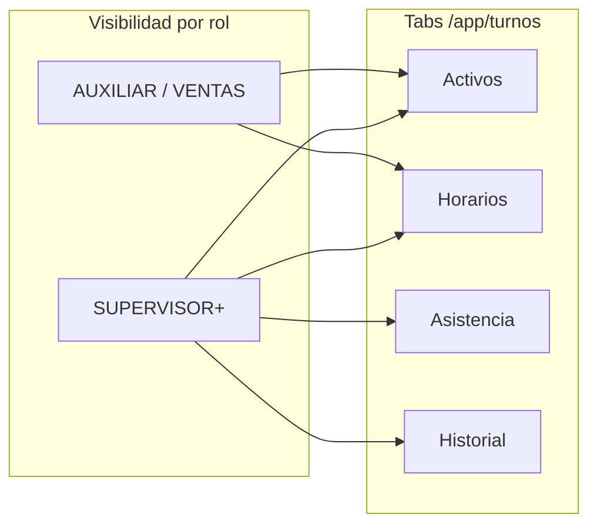
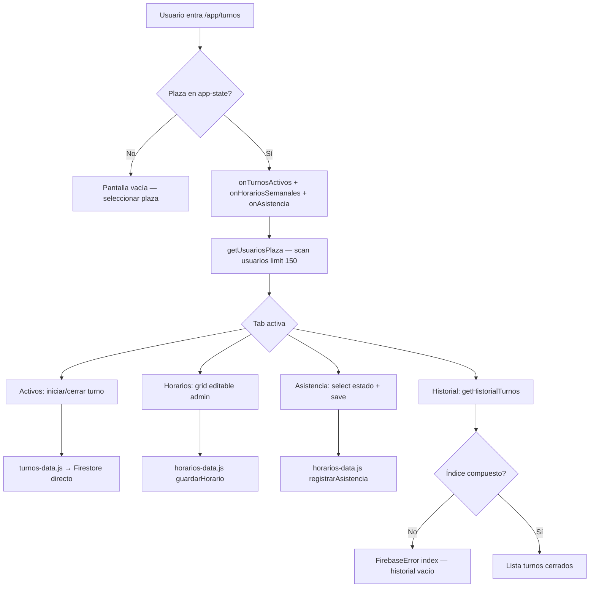
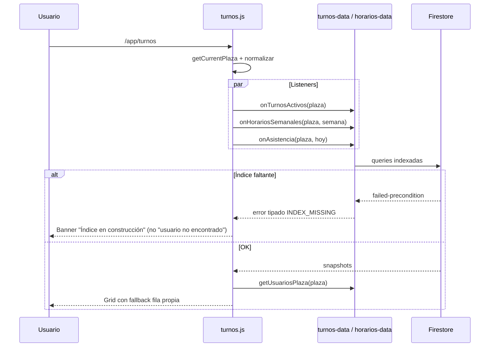
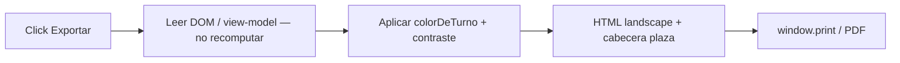
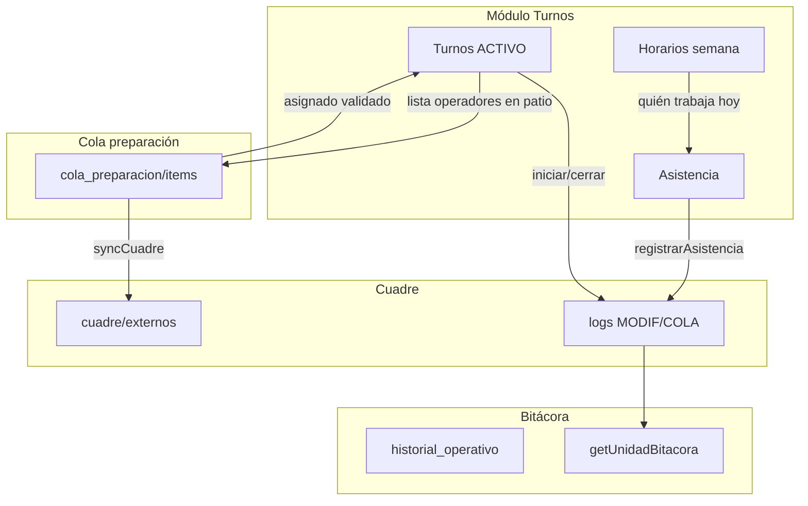
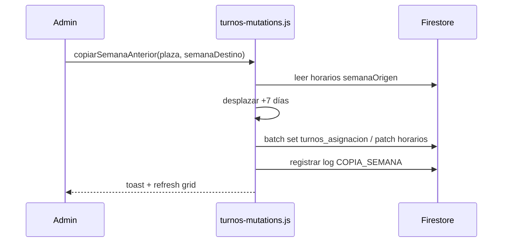

# Plan de mejora: Turnos y Horarios potenciados

> **Versión:** 2026-07-15  
> **Alcance:** planificación — sin implementación  
> **Audiencia:** desarrolladores del repo mex-mapa  
> **Fuente vault:** `/home/negrura/Escritorio/MYPROYECT/MapGestion/(07) TURNOS.md`  
> **Referencia UX/CHECADOR:** `/home/negrura/Escritorio/CHECADOR/ChecadorGLOBAL`

---

## 1. Estado actual

### 1.1 Arquitectura

Turnos es un módulo **SPA nativo** en `/app/turnos`, con capa parcial en `js/app/features/turnos/` pero **sin carpeta de mutaciones ni view-model** (a diferencia de mapa o la cola en evolución).

| Capa | Archivo(s) | Rol |
|------|-----------|-----|
| **Vista SPA (activa)** | `js/app/views/turnos.js` (~1100 líneas) | `mount`/`unmount`, UI completa, 4 tabs |
| **Datos turno operativo** | `js/app/features/turnos/turnos-data.js` | Check-in/out, `onTurnosActivos` |
| **Datos horarios/asistencia** | `js/app/features/turnos/horarios-data.js` | Grid semanal, asistencia, plantillas, notas |
| **Estilos** | `css/app-turnos.css` | Inyectado en `mount()` |
| **Router** | `js/app/router.js` L191-193 | `loader: turnos.js`, sin feature gate |
| **Navegación** | `js/shell/navigation.config.js` L127-130 | Item "Turnos y horarios" |
| **Reglas Firestore** | `firestore.rules` L1017-1086 | `turnos`, `horarios`, `asistencia`, `horarios_plantillas`, `notas_semana` |
| **Índices** | `firestore.indexes.json` L3-10 | Solo `asistencia (plaza, fecha)` — **faltan índices de historial** |

**Nota:** No hay página legacy standalone de turnos; todo vive en App Shell. No está en `ROUTE_MAP` de `route-resolver.js` (deuda de documentación de migración).

### 1.2 Tabs y permisos hoy



| Tab | Contenido | Quién edita |
|-----|-----------|-------------|
| **Activos** | Turnos `ACTIVO` en plaza; iniciar/cerrar propio turno | Todos inician el suyo; admin ve todos |
| **Horarios** | Grid semanal usuario × día (lun–dom) | Solo `ROLES_ADMIN` (SUPERVISOR+) |
| **Asistencia** | Registro diario PRESENTE/AUSENTE/TARDE/etc. | Solo admin |
| **Historial** | Turnos `CERRADO` con duración | Admin: plaza; no-admin: propios |

Gate admin hardcodeado en `turnos.js` L21-26 (`ROLES_ADMIN`); no usa `window.mexPerms.canDo()`.

### 1.3 Modelo Firestore actual

```
turnos/{turnoId}
  { usuarioId, usuarioNombre, usuarioRol, plazaId, inicio, fin, estado }
  estado: 'ACTIVO' | 'CERRADO'

horarios/{horarioId}
  { usuarioId, usuarioNombre, usuarioRol, plaza, semanaInicio (YYYY-MM-DD lunes),
    dias: { lun|mar|...|dom: { tipo, inicio, fin, nota? } },
    actualizadoPor, actualizadoEn, creadoEn }

asistencia/{asistenciaId}
  { usuarioId, usuarioNombre, plaza, fecha, estado, nota, turnoId?, registradoPor, registradoEn }

horarios_plantillas/{id}   — global, sin plaza
  { nombre, inicio, fin, creadoEn, actualizadoEn }

notas_semana/{plaza_semana}  — docId derivado en horarios-data.js L235-237
  { plaza, semana, notas: { lun: "...", ... } }
```

**No está en `COL`:** `js/core/database.js` no define constantes para `turnos`, `horarios`, `asistencia`, `horarios_plantillas`, `notas_semana`; los feature modules usan strings literales.

### 1.4 Flujo UX hoy



**Realtime:** `onSnapshot` en activos, horarios, asistencia, plantillas, notas semana — cleanup en `unmount()` (turnos.js L85-107).

**Exportar horarios:** ventana popup + `window.print()` (turnos.js L1000-1063); no réplica fiel CHECADOR (sin colores de turno, sin cabecera corporativa).

### 1.5 Comparación con CHECADOR (referencia)

Proyecto de referencia: **`/home/negrura/Escritorio/CHECADOR/ChecadorGLOBAL`**

| Patrón CHECADOR | Archivo | Estado en mex-mapa |
|-----------------|---------|-------------------|
| Catálogo de turnos con color, entrada/salida, pausa | `assets/js/admin/turnos.js`, `turno-color.mjs` | Parcial — solo plantillas globales sin color |
| Grid empleado × día con `<select>` coloreado | `turnos.js` L54-144 | Grid por usuario con editor modal por celda |
| Asignación `turnos_dia` (empleado + fecha → turno_id) | Supabase `turnos_dia`, migration `0023_sync_turno_dia.sql` | Modelo distinto: `horarios.dias` embebido por semana |
| Resolución turno efectivo del día (cascada) | `verificar_pin` en `0023_sync_turno_dia.sql` | No existe — asistencia no cruza con horario del día |
| Semana pasada solo lectura | `turnos.js` L71 | No implementado |
| Copiar semana anterior | `turnos.js` L209-233 | No implementado |
| PDF/imprimible = lo visible en pantalla | `pdfTurnos()` L146-196 | Export básico sin colores ni total horas |
| Paleta estable + contraste WCAG | `turno-color.mjs` | Colores fijos por `TIPOS_DIA` solamente |
| Scope por plaza + turnos globales | `plaza-scope.js`, `filterByPlaza` | Solo filtro `plazaAsignada` en usuarios |

### 1.6 Integración con Cuadre / Cola / Bitácora hoy

| Punto | Estado |
|-------|--------|
| Cola → turno patio | Descrito en `PLAN_MAESTRO.md` y `docs/plan-cola-preparacion-cuadre.md` Fase 3 — **no implementado** |
| Campo `asignado` en cola | Email/nombre libre — **no valida** contra turnos activos ni horario |
| Turnos activos → cuadre | **Ninguna** — no filtra operaciones por quién está en turno |
| Asistencia → bitácora | **Ninguna** — no escribe `logs`, `ops_events` ni `bitacora_gestion` |
| Horarios → notificación | **Ninguna** |
| `historial_patio` | Solo movimientos de cajón (MOVE/SWAP/DEL) — **sin eventos de personal** |
| Expediente unidad | Sin panel de turnos del operador asignado |

---

## 2. Problemas / oportunidades

### 2.1 Bugs P0 (bloquean operación)

| # | Síntoma | Causa | Fix propuesto |
|---|---------|-------|---------------|
| **P0-1** | Consola: `[asistencia] The query requires an index` | Query `asistencia` where `plaza` + rango `fecha` sin índice desplegado | Índice en `firestore.indexes.json` L3-10 existe en repo pero requiere `firebase deploy --only firestore:indexes`. Link consola: `https://console.firebase.google.com/v1/r/project/mex-mapa-bjx/firestore/indexes?create_composite=Ck9wcm9qZWN0cy9tZXgtbWFwYS1iangvZGF0YWJhc2VzLyhkZWZhdWx0KS9jb2xsZWN0aW9uR3JvdXBzL2FzaXN0ZW5jaWEvaW5kZXhlcy9fEAEaCQoFcGxhemEQARoJCgVmZWNoYRABGgwKCF9fbmFtZV9fEAE` |
| **P0-2** | Consola: `[turnos] historial: FirebaseError: The query requires an index` | `getHistorialTurnos` (`horarios-data.js` L184-191): `estado=='CERRADO'` + `plazaId` + `orderBy('inicio','desc')` — **índice ausente** en `firestore.indexes.json` | Añadir índice compuesto `turnos (estado, plazaId, inicio DESC)` y variante `(estado, usuarioId, inicio DESC)` |
| **P0-3** | "NO SE ENCONTRÓ TU USUARIO EN ESTA PLAZA" / grid vacío para usuario válido | Dos causas entrelazadas: (1) fallo de query asistencia colapsado en UI vacía; (2) `getUsuariosPlaza` filtra por `plazaAsignada` con scan limit 150 — perfiles con `plaza`/`plazaId` desincronizados o `uid` ≠ doc id quedan fuera | Normalizar campos plaza en filtro; fallback fila propia ya parcial (turnos.js L376-380); **separar mensajes** de error índice vs no pertenencia |
| **P0-4** | Datos de horarios corruptos en Firestore (capturas vault) | `guardarHorario` hace `update(base)` reemplazando `dias` entero; ediciones concurrentes o celdas parciales pueden dejar objetos anidados inconsistentes (`tipo` sin horas, claves inválidas) | Escritura atómica por celda (`dias.{diaKey}`) + validación schema antes de persistir |

### 2.2 Deuda funcional y UX (vault + CHECADOR)

- **Sin divisiones por rol operativo:** grid plano alfabético; el vault pide filas/secciones personalizables por plaza (CAPACITACIÓN, AUXILIAR, JEFE DE PATIO, VENTAS, AEROPUERTO) **independientes** de roles RBAC del sistema.
- **Filas fantasma:** usuarios listados sin celdas asignadas generan altura excesiva — hay que compactar o agrupar.
- **Header de días no sticky:** al scroll (mobile/desktop) se pierde contexto del día; vault sugiere header fijo en app y layout compacto en export.
- **Monolito en vista:** ~1100 líneas en `turnos.js` — difícil evolucionar grid, export y roles operativos.
- **Plantillas vs catálogo de turnos:** mex-mapa tiene plantillas de horario; CHECADOR tiene entidad `turnos` reutilizable con color — converger modelos.
- **Asistencia manual desconectada:** no compara horario programado vs registro real (TARDE automático).
- **Sin permisos granulares:** hardcode `ROLES_ADMIN` vs `mexPerms` / `permissions.model.js`.
- **`COL` incompleto:** strings sueltos en feature modules.
- **Check-in sin geolocalización/foto:** CHECADOR tiene checador físico + facial; mex-mapa solo timestamp (aceptable Fase 0, documentar gap).

---

## 3. Visión objetivo

Turnos debe ser el **tablero operativo de personal** de cada plaza, alineado visual y funcionalmente con CHECADOR pero integrado al ecosistema mex-mapa:

1. **Confiable desde día 0:** índices desplegados, usuarios siempre visibles en su plaza, datos no corruptos.
2. **Grid semanal potente:** divisiones por **rol operativo custom** (por plaza), header de días sticky, celdas compactas con color de turno, export = lo que se ve.
3. **Catálogo de turnos reutilizable** (como CHECADOR): nombre, entrada, salida, color, pausa opcional, alcance plaza/global.
4. **Asistencia inteligente:** cruza horario del día + turno activo; estados derivados cuando aplique.
5. **Integración operativa:** turnos activos alimentan cola (`asignado`), cuadre conoce quién opera, bitácora unificada.
6. **Arquitectura modular:** `js/app/features/turnos/` con `*-data.js`, `*-mutations.js`, `*-view-model.js`, `turno-color.js`.
7. **Una sola fuente de verdad** por plaza/semana/usuario — sin duplicar legacy.

---

## 4. Modelo de datos propuesto

### 4.1 Catálogo de turnos (nuevo — inspirado CHECADOR)

```
turnos_catalogo/{plaza}/items/{turnoId}
  - nombre: string          — "Mañana", "Tarde", "Aeropuerto"
  - horaEntrada: string     — "08:00"
  - horaSalida: string     — "16:00"
  - pausaMin: number        — 0 default
  - color: string?          — hex; fallback paleta por id (turno-color.mjs)
  - diasSemana: number[]?   — 1=lun..7=dom; opcional
  - activo: boolean
  - alcance: 'PLAZA' | 'GLOBAL'
  - creadoEn, actualizadoEn, actualizadoPor
```

Alternativa compatible: subcolección bajo `configuracion/{empresaId}/turnos_catalogo` si se prefiere config centralizada.

### 4.2 Roles operativos custom (nuevo — requisito vault)

```
turnos_roles_operativos/{plaza}/filas/{filaId}
  - nombre: string          — "CAPACITACIÓN", "AUXILIAR", "AEROPUERTO"
  - orden: number           — posición en grid
  - usuarioIds: string[]    — miembros de la fila (orden dentro de fila)
  - esSeparador: boolean    — fila solo título, sin usuarios
  - creadoEn, actualizadoEn
```

**Regla UX:** los roles operativos **no** se derivan de `usuario.rol` (RBAC). Un AUXILIAR del sistema puede estar en fila "AEROPUERTO". El RBAC sigue gobernando permisos de edición.

**Compactación:** usuarios sin ninguna celda con contenido en la semana visible → colapsar en sección "Sin asignar (N)" expandible, o excluir del export.

### 4.3 Horarios — evolución compatible

```
horarios/{horarioId}
  — campos actuales +
  - rolOperativoFilaId: string?     — fila custom
  - dias: {
      lun: {
        tipo: 'NORMAL'|'DESCANSO'|'VACACIONES'|'FESTIVO',
        turnoCatalogoId: string?,    — referencia catálogo (preferido)
        inicio, fin,                 — redundancia display / legacy
        nota
      }, ...
    }
  - version: number                 — optimistic concurrency
```

**Escritura segura (fix P0-4):**

```js
// Patch atómico por celda — no reemplazar dias entero
await ref.update({
  [`dias.${diaKey}`]: celdaValidada,
  actualizadoEn: serverTimestamp(),
  version: (prev.version || 0) + 1,
});
```

### 4.4 Asignación diaria explícita (opcional Fase 2 — paridad CHECADOR `turnos_dia`)

```
turnos_asignacion/{plaza}/dias/{fecha_usuarioId}
  - usuarioId, plaza, fecha (YYYY-MM-DD)
  - turnoCatalogoId: string | null   — null = descanso
  - origen: 'GRID' | 'COPIA_SEMANA' | 'IMPORT'
```

Permite resolver "turno efectivo hoy" con la misma cascada que CHECADOR (`0023_sync_turno_dia.sql`): asignación diaria > horario semanal > default.

### 4.5 Turnos operativos (check-in) — sin cambio de schema Fase 0

```
turnos/{turnoId}  — schema actual
  + opcional Fase 3: turnoCatalogoId, dispositivo, geo
```

### 4.6 Constantes en `database.js`

```js
COL.TURNOS:              'turnos',
COL.HORARIOS:            'horarios',
COL.ASISTENCIA:          'asistencia',
COL.HORARIOS_PLANTILLAS: 'horarios_plantillas',
COL.NOTAS_SEMANA:        'notas_semana',
COL.TURNOS_CATALOGO:     'turnos_catalogo',      // Fase 1
COL.TURNOS_ROLES_OP:     'turnos_roles_operativos', // Fase 1
COL.TURNOS_ASIGNACION:   'turnos_asignacion',     // Fase 2
```

### 4.7 Índices Firestore requeridos

| Colección | Campos | Uso |
|-----------|--------|-----|
| `asistencia` | `plaza ASC`, `fecha ASC` | Tab asistencia — **P0 deploy** |
| `turnos` | `estado ASC`, `plazaId ASC`, `inicio DESC` | Historial admin |
| `turnos` | `estado ASC`, `usuarioId ASC`, `inicio DESC` | Historial propio |
| `horarios` | `plaza ASC`, `semanaInicio ASC` | Ya funciona (single-field + filter) |
| `turnos_asignacion` | `plaza ASC`, `fecha ASC` | Fase 2 — rango semanal |

---

## 5. Flujos principales

### 5.1 Carga inicial (post P0)



### 5.2 Grid semanal con roles operativos

```mermaid
flowchart TD
    A[Admin abre tab Horarios] --> B[Cargar turnos_roles_operativos/plaza]
    B --> C[Cargar turnos_catalogo + horarios semana]
    C --> D[view-model: agrupar usuarios por fila custom]
    D --> E{Usuario tiene celdas?}
    E -->|Sí| F[Fila en su rol operativo]
    E -->|No| G[Sección colapsable Sin asignar]
    F --> H[Celda: turno catálogo o tipo día]
    H --> I[turnos-mutations.patchCelda]
    I --> J[Firestore patch atómico dias.{dia}]
```

**Header sticky:** CSS `position: sticky; top: 0` en `<thead>` dentro de `.tu-grid-wrap`; en export PDF/html usar tabla repetida `thead` con `@media print`.

### 5.3 Export (paridad CHECADOR)



Referencia implementación: CHECADOR `pdfTurnos()` L146-196 — lee `<select>` en vivo para reflejar exactamente lo visible.

### 5.4 Integración Turnos ↔ Cola ↔ Cuadre ↔ Bitácora



**Eventos `logs` propuestos (tipo `TURNO`):**

| Evento | Mensaje ejemplo |
|--------|-----------------|
| CHECKIN | `🟢 TURNO INICIO: {nombre} · {plaza} · {hora}` |
| CHECKOUT | `🔴 TURNO FIN: {nombre} · duración {dur}` |
| ASISTENCIA | `📋 ASISTENCIA: {nombre} · {fecha} · {estado}` |
| HORARIO | `📅 HORARIO: {nombre} · {dia} → {turnoNombre}` |

**Cola Fase 3 (`plan-cola-preparacion-cuadre.md`):**

- Dropdown `asignado` en cola: poblar desde `turnos ACTIVO` de la plaza + horario del día.
- Push "turno patio": notificar a usuarios con turno activo X horas antes de `fechaSalida` de ítems cola urgentes.
- Panel cuadre/expediente: badge "Operador en turno: {nombre}".

**Bitácora:**

- Extender `getUnidadBitacora` (`cuadre-data.js`) con query `logs` tipo `TURNO` filtrado por `actor` o campo `operadorId` — **no** mezclar con `historial_patio` (solo cajones).
- Eventos admin sensibles (edición masiva horarios) → `bitacora_gestion` vía `reportProgrammerError` / audit helper existente.

### 5.5 Copiar semana anterior (CHECADOR)



Solo semanas futuras editables (CHECADOR L71: semana pasada readonly).

---

## 6. Fases de implementación

### Fase 0 — P0 estabilización (inmediato, 3–5 días)

**Objetivo:** turnos usable en producción; cero errores de índice; datos íntegros.

| Tarea | Archivos |
|-------|----------|
| Desplegar índice `asistencia (plaza, fecha)` | `firestore.indexes.json` + `firebase deploy --only firestore:indexes` |
| Añadir índices `turnos` historial | `firestore.indexes.json` |
| Errores tipados en listeners | `horarios-data.js` — distinguir `failed-precondition` |
| UI banner índice vs plaza | `turnos.js` — no mensaje "usuario no encontrado" por error Firestore |
| Fallback fila propia robusto | `turnos.js` L376-380, `getUsuariosPlaza` normalizar `plaza/plazaId/plazaAsignada` |
| Patch atómico celdas horario | `horarios-data.js` `guardarHorarioCelda()` |
| Validación schema celda | `turnos-view-model.js` (nuevo, mínimo) |
| Usar Firebase Auth UID en queries | Confirmar `u.uid \|\| u.id` en todo match con `horarios.usuarioId` |
| QA smoke índices Enabled | Consola Firebase |

### Fase 1 — Modularización + catálogo + roles operativos (1–2 sprints)

**Objetivo:** deuda estructural; divisiones custom del vault; base CHECADOR.

| Tarea | Archivos |
|-------|----------|
| Feature folder completo | `turnos-data.js`, `horarios-data.js` (existentes) |
| | `turnos-mutations.js` — check-in/out, patch celda, CRUD catálogo |
| | `turnos-view-model.js` — agrupación filas, compactación, sticky meta |
| | `turno-color.js` — port de CHECADOR `turno-color.mjs` |
| Constantes COL | `js/core/database.js` |
| CRUD `turnos_catalogo` | mutations + reglas Firestore |
| CRUD `turnos_roles_operativos` | UI admin en tab Horarios — reordenar filas DnD |
| Refactor vista | `turnos.js` → importar view-model/mutations; reducir a <600 líneas |
| Reglas Firestore nuevas colecciones | `firestore.rules` |
| Route resolver entry | `js/app/route-resolver.js` — `shellIntegrated: true` |
| Permisos | `domain/permissions.model.js` — `manage_turnos`, `view_turnos` |

### Fase 2 — Paridad CHECADOR grid/export (2 sprints)

**Objetivo:** UX referencia; semana readonly; copiar semana; export fiel.

| Tarea | Archivos |
|-------|----------|
| Grid con `<select>` coloreado o celdas compactas | `turnos.js` + `css/app-turnos.css` |
| Header días sticky | CSS + test mobile |
| Semana pasada readonly | view-model `esSemanaPasada(semana)` |
| Copiar semana anterior | `turnos-mutations.copiarSemanaAnterior` |
| Export PDF/html landscape | port lógica CHECADOR `pdfTurnos` |
| `turnos_asignacion` diaria (opcional) | data + mutations + índice |
| Asistencia vs horario | auto-sugerir TARDE si check-in > entrada + tolerancia |
| Sección "Sin asignar" colapsable | view-model |

### Fase 3 — Integración Cola / Cuadre / Bitácora (2–3 sprints)

**Objetivo:** ecosistema operativo conectado (alineado con `plan-cola-preparacion-cuadre.md`).

| Tarea | Archivos |
|-------|----------|
| Logs tipo TURNO en mutaciones | `turnos-mutations.js` → `_registrarLog` / bridge `mex-api.js` |
| Extender `getUnidadBitacora` | `cuadre-data.js` — incluir logs TURNO del operador |
| Cola: dropdown asignado ← turnos activos | `cola-preparacion.js` / `cola-mutations.js` |
| Cola: push turno patio | `functions/index.js`, `notifications.js` |
| Dashboard widget "En turno ahora" | `dashboard.js` |
| Cuadre: indicador operador en turno | `cuadre.js` / futura SPA cuadre |
| API ensamblada opcional | `api/turnos.js` + `_assemble.js` |

### Fase 4 — Consolidación y CHECADOR bridge (opcional, 1+ sprint)

**Objetivo:** sync externo si se mantiene CHECADOR en paralelo; cierre de deuda.

| Tarea | Archivos |
|-------|----------|
| CF sync CHECADOR → Firestore (si aplica) | `functions/index.js` — webhook/scheduled |
| Import CSV empleados/turnos | script one-shot |
| Eliminar plantillas legacy si catálogo cubre | migración lazy |
| Docs migración | `docs/app-real-view-migration-status.md` |
| Permisos finos por fila operativa | feature gate opcional |

---

## 7. Riesgos y decisiones abiertas

| # | Pregunta para Product Owner |
|---|----------------------------|
| 1 | ¿Los **roles operativos** los gestiona solo JEFE_PATIO+ o también SUPERVISOR? |
| 2 | ¿Un usuario puede estar en **más de una fila** operativa (ej. backup)? |
| 3 | ¿Usuarios "sin asignar" se **ocultan** por default o siempre visibles? |
| 4 | ¿Catálogo de turnos es **por plaza** o hay turnos globales corporativos (como CHECADOR `plaza_id null`)? |
| 5 | ¿Completar asistencia **TARDE** automático con tolerancia de cuántos minutos? |
| 6 | ¿Check-in/out debe escribir **asistencia** automáticamente o seguir manual? |
| 7 | ¿Integración cola: `asignado` **obliga** turno activo o solo sugiere? |
| 8 | ¿Export incluye **notas generales de día** y notas por celda? |
| 9 | ¿Se mantiene CHECADOR como fuente paralela o mex-mapa reemplaza totalmente? |
| 10 | ¿Eventos van a `logs`, `bitacora_gestion`, o ambos según tipo? |

**Riesgos técnicos:**

- **Doble modelo horario** (`horarios.dias` vs `turnos_asignacion`) — definir fuente de verdad o cascada explícita (patrón CHECADOR 0023).
- **Scan usuarios limit 150** — escalar a query indexada `usuarios where plazaAsignada == plaza` cuando exista índice.
- **Migración datos corruptos** — script de saneamiento antes de Fase 1; backup Firestore.
- **Sticky + export** — validar en iOS Safari y Chrome Android.
- **Roles operativos vs RBAC** — documentar que son conceptos ortogonales para evitar confusión en soporte.

---

## 8. Checklist QA / smoke

### Tras Fase 0 (P0)

- [ ] Índice `asistencia (plaza, fecha)` en estado **Enabled** en consola Firebase.
- [ ] Índice `turnos (estado, plazaId, inicio DESC)` Enabled.
- [ ] `/app/turnos` carga tab Asistencia sin error consola.
- [ ] Tab Historial lista turnos cerrados (admin y no-admin).
- [ ] Usuario AUXILIAR de la plaza ve **su fila** en Horarios aunque `getUsuariosPlaza` falle.
- [ ] Error de índice muestra banner técnico — **no** "NO SE ENCONTRÓ TU USUARIO".
- [ ] Editar celda horario persiste; recarga no pierde datos ni corrompe `dias`.
- [ ] Check-in usa Auth UID; reglas Firestore permiten create.
- [ ] `unmount` no deja listeners activos.
- [ ] `node scripts/test-mapa.js` sigue pasando.

### Tras Fase 1

- [ ] CRUD catálogo turnos: crear "Mañana 08:00–16:00" con color.
- [ ] CRUD filas operativas: crear "AEROPUERTO", asignar usuarios, reordenar.
- [ ] Grid agrupa por fila operativa; RBAC del usuario no cambia fila automáticamente.
- [ ] Constantes `COL.TURNOS*` usadas en feature modules.
- [ ] Permiso `manage_turnos` bloquea edición a AUXILIAR.

### Tras Fase 2

- [ ] Header días permanece visible al scroll (desktop + mobile).
- [ ] Semana pasada: celdas disabled, banner readonly.
- [ ] Copiar semana anterior replica asignaciones.
- [ ] Export PDF/imprimible coincide con colores pantalla.
- [ ] Sección "Sin asignar" colapsa usuarios sin celdas.
- [ ] Total horas semana calculado (como CHECADOR L118-122).

### Tras Fase 3

- [ ] Check-in genera entrada `logs` tipo TURNO.
- [ ] Cola: selector asignado lista operadores en turno activo.
- [ ] Push/notificación turno patio configurable.
- [ ] Expediente/bitácora muestra eventos TURNO del operador.
- [ ] Cambio plaza en shell recarga listeners sin race.

### Tras Fase 4

- [ ] Sync CHECADOR (si aplica) no duplica horarios.
- [ ] Documentación migración actualizada en `docs/app-real-view-migration-status.md`.

---

## Referencias de código

| Concepto | Ubicación |
|----------|-----------|
| Vista SPA turnos | `js/app/views/turnos.js` |
| Check-in/out | `js/app/features/turnos/turnos-data.js` |
| Horarios/asistencia | `js/app/features/turnos/horarios-data.js` |
| Fallback fila propia | `js/app/views/turnos.js` L376-380 |
| Error historial índice | `js/app/views/turnos.js` L1073-1088 |
| Query historial | `js/app/features/turnos/horarios-data.js` L184-191 |
| Reglas Firestore | `firestore.rules` L1017-1086 |
| Índice asistencia | `firestore.indexes.json` L3-10 |
| CHECADOR grid + PDF | `/home/negrura/Escritorio/CHECADOR/ChecadorGLOBAL/assets/js/admin/turnos.js` |
| CHECADOR colores | `.../assets/js/admin/turno-color.mjs` |
| CHECADOR cascada turno día | `.../supabase/migrations/0023_sync_turno_dia.sql` |
| Plan cola integración | `docs/plan-cola-preparacion-cuadre.md` |
| Spec bugs Fase 1.2 | `docs/superpowers/specs/2026-06-30-mapgestion-roadmap-fase1-design.md` L83-100 |
| Vault original | `/home/negrura/Escritorio/MYPROYECT/MapGestion/(07) TURNOS.md` |

---

## Resumen ejecutivo

- Turnos funciona en App Shell con check-in, grid semanal y asistencia, pero **P0 bloquea operación**: índice `asistencia` sin desplegar, índice `turnos` historial ausente, y errores Firestore mal interpretados como "usuario no en plaza". Datos de horarios pueden **corromperse** por updates no atómicos.
- El vault exige **divisiones por rol operativo custom** (por plaza, no RBAC), grid compacto con header fijo y export fiel — patrones ya resueltos en **CHECADOR** (`/home/negrura/Escritorio/CHECADOR/ChecadorGLOBAL`).
- El plan propone **5 fases (0–4)**: (0) índices + integridad, (1) modularización + catálogo + roles operativos, (2) paridad CHECADOR grid/export, (3) integración cola-cuadre-bitácora, (4) consolidación opcional con CHECADOR.
- Prioridad inmediata: **desplegar índices**, patch atómico de celdas, y mensajes de error correctos — sin eso, las fases siguientes no aportan valor.
