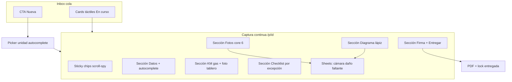

# Diseño: Papeletas — captura tipo app (hoja + lápiz)

> **Fecha:** 2026-07-22  
> **Estado:** draft para revisión de usuario  
> **Esfuerzo:** máximo — pivote UX sobre dominio ya shipped  
> **Modelo de diseño:** Fable 5 solicitado (API no disponible en sesión; spec elaborado con exploración completa del código + docs 2026-07-20)  
> **Relación con specs previos:**
> - Conserva dominio/datos de [`2026-07-20-papeletas-mobile-app-redesign-design.md`](./2026-07-20-papeletas-mobile-app-redesign-design.md) (`ZONAS_CORE`, `puedeEntregar`, `danosMarcados`, `finalizeDelivery`, immutability).
> - **Reemplaza la metáfora UX de “wizard 6 pantallas”** como experiencia primaria.
> - Complementa (no borra) [`2026-07-20-papeletas-digitales-design.md`](./2026-07-20-papeletas-digitales-design.md).

---

## 0. Veredicto de producto

**Papeletas no es un listado operativo.** Es un **módulo de captura**.

La regla de oro “tabla + rutas list/nuevo/detalle” aplica a Notas, Traslados, Unidades, Reportes de daños. **Papeletas es la excepción explícita:** debe imitar la **rapidez de la hoja y el lápiz** — una sola superficie de llenado, táctil, con autocomplete agresivo y diagrama fluido.

Hoy el módulo ya tiene dominio sólido (6 pasos, core fotos, daños tipados), pero la **bandeja parece Traslados** (`pap-table` en desktop + wizard por pasos). El patio necesita lo contrario: **menos navegación entre pantallas, más completar en sitio**.

### Meta medible

| Métrica | Objetivo |
|---------|----------|
| Tiempo de captura operativa (excl. disparar cámara) | ≤ **90 s** mediana en patio |
| Toques para elegir unidad (MVA conocido) | ≤ **3** (buscar → hit → confirmar) |
| Pantallas full-page para completar salida | **1** superficie de captura (+ sheets/overlays) |
| Toques para marcar un daño tipado | ≤ **4** (tap → tipo → severidad → listo; foto opcional soft) |
| Fallos de guardado visibles sin bloquear escritura | Chip `Guardando…` / `Guardado` / conflicto |

---

## 0A. Lógica de negocio pura (alcance GLOBAL) — ley del dominio

> Fuente de verdad en código: `domain/papeleta.model.js` (`PAPELETA_SCOPE`, `mutationPolicy`, `puedeEntregar`, `buildEventStamp`, …).  
> La UI **no** inventa estas reglas; solo las refleja.

### 0A.1 Excepción de alcance: empresa-global, no por plaza

| Regla | Detalle |
|-------|---------|
| **Scope** | Una papeleta pertenece a la **empresa**, no a una plaza. |
| **Flujo real** | Se puede **crear en BJX** y **completar / entregar en GDL** cuando llega el auto (u otra plaza). |
| **Bandeja** | Inbox lista **todas** las activas/recientes de la empresa. **Prohibido** filtrar por `plazaId == plazaActual` como default. |
| **`plazaId` en el doc** | Sello de **procedencia** (plaza de origen al crear). No es llave de partición de datos. |
| **Sellos adicionales** | `plazaOrigenId`, `ultimaPlazaId`, `entregadaPlazaId`, `entradaPlazaId` — auditoría de dónde se tocó. |
| **Unicidad** | Sigue siendo **1 papeleta activa por unidad** (`activoPorUnidad` + lock `papeletas_activas/{unidadId}`), sin importar plaza. |
| **Autocomplete unidad** | Catálogo **empresa** (`mexUnidades`); ranking “plaza actual” solo **prioriza**, nunca oculta unidades de otras plazas. |

**Bug actual a corregir en data/UI:** `subscribePapeletasPlaza({ plazaId })` y el mount de la vista pasan la plaza activa → **dividen** el inbox. Debe pasar a suscripción empresa-global (`orderBy actualizadoAt`, sin `where plazaId`) + `orderInboxGlobal(rows, { preferPlazaId })` solo para orden UX.

### 0A.2 Matriz de mutación (rápida y dura)

| Acción | `borrador` | `lista` | `entregada` | `en_retorno` | `cerrada_historial` / `cancelada` |
|--------|:---:|:---:|:---:|:---:|:---:|
| Editar salida (KM, gas, checklist, diagrama, fotos salida, firma previa) | ✓ | ✓ | **✗** | **✗** | **✗** |
| Asignar / corregir **cliente** | ✓ | ✓ | ✓ | ✓ | ✗ |
| Asignar / corregir **contrato** | ✓ | ✓ | ✓ | ✓ | ✗ |
| Entregar (`finalizeDelivery`) | si hard OK | si hard OK | no-op idempotente | ✗ | ✗ |
| Registrar regreso / entrada | ✗ | ✗ | ✓ | ✓ | ✗ |
| Cancelar | ✓ | ✓ | ✗ | ✗ | ✗ |

**Regla de oro de edición:**

1. **Antes de `entregada`:** salida editable (autosave + `revision`).
2. **Desde `entregada` inclusive:** salida **inmutable** (`isSalidaLocked` / `assertSalidaMutable`). Domain + data + (preferible) Firestore rules.
3. Cliente/contrato **no** forman parte del candado de salida: se pueden completar **después** (patio entregó sin saber el nombre; Ventas asigna luego).

Helpers: `puedeEditar` ≡ `isSalidaMutable`; `mutationPolicy(status)`; `canAssignCliente` / `canAssignContrato`.

### 0A.3 Sellos de auditoría en cada evento

Cada create / autosave / entrega / regreso debe persistir (vía `buildEventStamp` / `buildTouchProvenance`):

| Campo | Origen |
|-------|--------|
| `uid` / `*Por` | Usuario autenticado |
| `*PorNombre` | Nombre del usuario (perfil / displayName) |
| `plazaId` / `ultimaPlazaId` / `entregadaPlazaId`… | Plaza **del lugar** donde ocurre el gesto (context shell), no “plaza dueña” del expediente |
| `*AtLocal` | Fecha/hora **local del dispositivo** (`formatLocalStamp`) — “fecha del lugar” |
| `*At` server | `serverTimestamp` en data layer (autoridad de reloj) |

Al **entregar**, además: `entregadaPor`, `entregadaPorNombre`, `entregadaPlazaId`, `entregadaAt`, `entregadaAtLocal`.

### 0A.4 Cliente y contrato (soft, diferibles)

- Al crear: `clienteNombre: ''`, `contrato: ''` (o ausente) — **válido**.
- Entregar **sin** cliente ni contrato: permitido; soft warning `cliente` en `puedeEntregar` (sheet de confirmación). Si hay `firma.signerName` o ya hay cliente/contrato → no soft.
- Post-entrega: `asignarCliente` / patch `contrato` siguen permitidos (`canAssign*`).
- CRM/contrato “real” (lookup SIPP, etc.) sigue **non-goal**; el campo texto `contrato` sí es de producto.

### 0A.5 Gates de entrega (sin inventar en UI)

- **Hard** (bloquean): `km`, `gas`, `checklist`, `core_photos`, `firma`, `pending_writes`, `km_justification` si aplica. **No** incluyen plaza ni cliente.
- **Soft** (confirmar): `cliente` (si no hay cliente/contrato/signer), faltantes, fotos de daño, fotos opcionales, daños grandes sin reporte Ventas, etc.
- Finalize: `finalizeDelivery` único, idempotente si ya `entregada`.

### 0A.6 Qué NO cambia

- Status machine español (`borrador` → … → `cerrada_historial`).
- `ZONAS_CORE` / unicidad por unidad.
- PDF firmado (export-signing) al entregar.
- Reportes de daños = módulo aparte.

---

## 1. Problema actual (código)

### 1.1 Qué ya funciona (mantener)

| Capacidad | Dónde |
|-----------|--------|
| Estados + unicidad activa | `domain/papeleta.model.js`, `papeletas-data.js` |
| `ZONAS_CORE` (6) + extras | `papeleta.model.js` |
| `puedeEntregar` hard/soft | domain |
| Diagrama PNG + pen + marcas tipadas | `papeletas-diagram.js` |
| Cámara guiada | `papeletas-camera.js` |
| PDF / export firmado | `papeletas-pdf.js` + export-signing |
| Rutas `/app/papeletas`, `/nueva`, `/p/:id` | `router.js`, `papeletas.js` |
| Reportes daño → `/app/reportes-danos` | ya separado |

### 1.2 Qué frena “hoja + lápiz”

1. **Inbox tipo tabla** en desktop (`pap-table-wrap--desktop`) — compite visualmente con Traslados/Unidades y empuja mentalidad “consultar filas”, no “llenar hoja”.
2. **Wizard por `_wizardStep`** — cada sección es un cambio de panel; rompe continuidad de la hoja física.
3. **Autocomplete de unidad** usa `buscarUnidad` en nueva, pero el catálogo global `window.mexUnidades` (más rápido / ya caliente) no es el path primario unificado; ranking por plaza / “unidad en patio” flojo.
4. **Diagrama** — tool switching mark/pen, vistas, undo/clear existen, pero:
   - latencia percibida al remount del diagrama en cada paint de step;
   - hit targets pequeños en móvil;
   - freehand sin presión/snap a panel;
   - falta “lápiz siempre listo” + tap-hold para tipo de daño (gesto papel).
5. **Fotos** aún pueden sentirse como tour largo si el orden core no está en el mismo scroll que KM/checklist.
6. **Archivo monolito** `papeletas.js` (~3k líneas) — difícil iterar UI sin regresiones.
7. **Inbox filtrado por plaza** (`subscribePapeletasPlaza` + `plazaId` en mount) — **contradice** el alcance global (§0A): una papeleta creada en BJX no aparece en GDL.

---

## 2. Principios de diseño (Fable-grade)

1. **Una hoja, un gesto.** La captura de salida es **un scroll vertical continuo** con secciones ancladas; no un carrusel de 6 pantallas.
2. **El lápiz manda.** Diagrama y checklist viven “arriba del pliegue” en móvil; tablas/admin fuera de la captura.
3. **Global por empresa.** Inbox y búsqueda de unidad no se parten por plaza; la plaza solo sella auditoría y prioriza ranking.
4. **Autocomplete before type.** MVA/placas/cliente sugieren en ≤150 ms desde cache local (`mexUnidades` empresa).
5. **Sheets, no páginas.** Cámara, tipo de daño, faltante de checklist = bottom sheet / fullscreen overlay; al cerrar vuelves al **mismo scroll offset**.
6. **Progreso sin wizard.** Chips de sección sticky (`Datos · KM · Checklist · Daños · Fotos · Firma`) hacen scroll-spy, no `navigate` entre steps.
7. **Inbox = cola de trabajo**, no spreadsheet. Cards táctiles; desktop también cards (grid), no `pap-table` como default.
8. **Domain remains law.** UI no inventa `puedeEntregar` ni el candado post-`entregada`; solo refleja `mutationPolicy` / `hard`/`soft`.
9. **Offline-soft.** Draft local + autosave; no finalize offline (igual que spec 07-20 §11).

---

## 3. Excepción a la regla de oro “tabla + rutas”

Actualizar `agente.md` / `.cursor/rules/spa-list-table-routes.mdc`:

> **Módulos de captura en patio** (Papeletas y futuros “formularios de llenado rápido”) **no** usan tabla densa como superficie primaria. Usan **superficie única + sheets**. Las rutas `/nueva` y `/p/:id` se conservan, pero el detalle es **captura continua**, no editor tabular.

Bandejas secundarias (historial largo, admin) sí pueden usar tabla.

---

## 4. Arquitectura UX propuesta

### 4.1 Inbox (`/app/papeletas`)

- **Default:** grid/lista de **cards** (también en desktop ≥900px).
- **Alcance:** suscripción **empresa-global** (sin `where plazaId`). Chip opcional “Cerca de {plaza}” solo reordena (`orderInboxGlobal`).
- Card muestra: MVA, modelo, chip estado, **plaza origen / última**, progreso `Core 4/6`, cliente o “Sin cliente”, tiempo relativo.
- Quitar o degradar `pap-table` a “Vista compacta” opcional (oculto por default).
- Filtros: chips `En curso | Entregadas | Historial` (canceladas en menú “Más”).
- CTA primario grande **Nueva papeleta**.
- Deep-link `?mva=` abre picker prefiltrado o la activa de esa unidad.

### 4.2 Picker de unidad (`/nueva` o sheet desde inbox)

- Input grande + teclado numérico/alfanumérico.
- Fuente: **`window.mexUnidades.buscar`** primero; fallback `buscarUnidad` API si cache frío.
- Ranking:
  1. Match exacto MVA/placas
  2. Unidad en plaza actual / patio (**boost**, no filtro)
  3. Prefijo MVA
  4. Modelo contiene
- Hits de **cualquier plaza** de la empresa son válidos (el auto puede estar en tránsito / otra plaza).
- Card hit: MVA · placas · modelo · plaza · estado flota · badge “Ya hay papeleta activa” → **Abrir** (no crear).
- Confirmación = create TX (igual dominio actual) + `buildCreateProvenance` (plaza del lugar + usuario + fecha local).
- QR: CTA si hardware; si no, “Próximamente” (sin bloquear).

### 4.3 Captura continua (`/app/papeletas/p/:uid`) — corazón del rediseño

**Chrome**

- Header compacto: atrás · MVA · chip guardado · menú (PDF, cancelar, regreso si aplica).
- **Sticky section chips** (scroll-spy): Datos | KM | Check | Daños | Fotos | Firma.
- **No** footer Atrás/Continuar entre pantallas. En su lugar:
  - FAB opcional “Siguiente hueco” (salta al primer `hard` pendiente de `puedeEntregar`).
  - Al final: botón **Entregar** sticky (disabled + tooltip de `hard[]`).

**Secciones en un solo scroll**

| Sección | Contenido | Interacción rápida |
|---------|-----------|-------------------|
| Datos | Ficha autofill + cliente/contrato opcionales | Soft: asignar después; Corregir → sheet |
| KM / gas | KM grande, grid gas, foto tablero inline | Soft warn retake si cambia KM post-foto |
| Checklist | “Todo OK” + excepciones | Tap fila → sheet Presente/Faltante/N/A |
| Daños | Diagrama full-bleed + lista marcas | Ver §5 |
| Fotos core | 6 thumbnails en fila/grid | Tap hueco → cámara guiada sheet |
| Firma | Canvas firma + nombre | Entregar llama `finalizeDelivery` |

**Post-entrega:** misma ruta, modo readonly + tabs Regreso / Reportar (sheets), sin reabrir captura.

---

## 5. Diagrama v3 — “lápiz primero”

### 5.1 Metas

- Sentir **bolígrafo sobre hoja**: ink inmediato, sin remount del host en cada autosave.
- Tap corto = **marca tipada** (flujo sheet tipo/severidad).
- Drag = **trazo libre** (pen default si el dedo se mueve >8px).
- Long-press = atajo al último tipo de daño usado.
- Undo con gesto o botón sticky; clear con confirm.

### 5.2 Mejoras técnicas (`papeletas-diagram.js`)

| Mejora | Detalle |
|--------|---------|
| Persist mount | No destruir/recrear diagrama en re-render de sección; API `setDamages` / `setStrokes` |
| Pointer Events | Unificar mouse/touch/pen; `touch-action: none` en stage |
| Coalesced events | `getCoalescedEvents()` para trazos suaves en alta frecuencia |
| Hit slop | Marcas ≥ 44×44 CSS px; glow al seleccionar |
| Vistas | Segmented top/front/rear/left/right **sin perder zoom/pan** |
| Pan/zoom opcional | Pinch-zoom en diagrama; doble-tap reset |
| Snap suave | Opcional: magnet a bounding boxes de paneles si se define mapa hit (v2.1) |
| Overlay números | `displayNumber` siempre legible (halo blanco) |
| Export | Raster hi-DPI para PDF (ya parcial) — garantizar 2× |

### 5.3 Flujo de daño (sheet)

1. Tap en carrocería → sheet inferior:
   - Tipo (grid iconos: rayón, profundo, abolladura, cristal, faltante, golpe, otro)
   - Severidad (chico/mediano/grande)
   - Nota 1 línea
   - Foto evidencia (soft según `DAMAGE_PHOTO_POLICY`)
2. Guardar → marca visible al instante + autosave.
3. Tap en marca existente → editar/borrar (solo si `isSalidaMutable`).

### 5.4 Assets

- Mantener `car-drawable.png` como base.
- Evaluar variante **alto contraste patio** (sol) y dark-theme outline.
- No volver a la HOJA escaneada como fondo interactivo (solo referencia formal PDF).

---

## 6. Autocomplete system (unificado)

### 6.1 Unidad

- Adapter único `papLookupUnidad(q)`:
  - `mexUnidades.buscar(q, 12)` si `isReady()`
  - else `buscarUnidad` + warm cache
- Debounce 80–120 ms; cancelación por seq.
- Mostrar “Catálogo cargando…” solo si `!isReady` y q length ≥ 1.

### 6.2 Campos de texto de captura

| Campo | Fuente sugerida |
|-------|-----------------|
| Cliente | Últimos `clienteNombre` de papeletas empresa + ventas (no solo plaza) |
| Contrato | Texto libre + últimos usados empresa |
| Firma signer | = cliente si vacío; si no hay cliente, nombre en firma cuenta como soft OK |
| Notas de daño | snippets recientes por tipo (localStorage) |
| Marca llanta | lista corta configurable / últimos usados |

### 6.3 UX del completer

- Lista bajo input, teclado no tapa (scroll into view).
- Enter selecciona primer hit.
- Esc cierra.
- A11y: `listbox` / `option`.

---

## 7. Fotos core en la misma hoja

- Grid 2×3 (móvil) de `ZONAS_CORE` con estado vacío / ok / retomar.
- Tap → `openGuidedCamera` en sheet fullscreen; al cerrar, scroll permanece en Fotos.
- Orden guiado sugerido (FAB “Siguiente foto”) sin forzar bloqueo de otras secciones.
- Soft warnings de `puedeEntregar.soft` visibles como pills ámbar en chips sticky.

---

## 8. Entrega y regreso

- **Entregar:** botón sticky inferior; disabled si `hard.length`; al tap muestra resumen sheet (soft warnings) → confirmar → firma si falta → `finalizeDelivery`.
- **Regreso:** sección o modo readonly + “Registrar entrada”; comparación de daños en diagrama dual (salida fantasma / entrada editable) — conservar lógica `buildEntradaDamageComparison`.
- Reportes siguen yendo a **Reportes de daños** (tabla+rutas); no mezclar bandeja Ventas dentro de la hoja.

---

## 9. Información arquitectura (código)

### 9.1 Archivos a tocar (implementación futura)

| Archivo | Cambio |
|---------|--------|
| `domain/papeleta.model.js` | Scope global, stamps, `mutationPolicy`, soft cliente/contrato (**hecho en dominio**) |
| `papeletas-data.js` | `subscribePapeletasEmpresa` (sin plaza); stamps en create/update/finalize; `asignarContrato` |
| `js/app/views/papeletas.js` | Captura continua; inbox global cards; quitar filtro plaza default |
| `css/app-papeletas.css` | Tokens app móvil; sticky chips; diagram stage; quitar énfasis table |
| `papeletas-diagram.js` | v3 pointer + persist mount + gesture |
| `unidades-lookup.js` / thin `papeletas-lookup.js` | Adapter ranking con boost plaza, sin ocultar |
| `papeletas-camera.js` | Sheet-friendly open/close restore scroll |
| `agente.md` + rule spa-list | Excepción captura + nota scope global |

### 9.2 Qué no romper

- Collection statuses español
- `ZONAS_V1` ids + `ZONAS_CORE`
- Storage paths y PDF signing
- Perms `view_papeletas` / `manage_papeletas_ventas`
- Rutas públicas actuales
- Reportes en módulo aparte

### 9.3 Refactor recomendado (no bloqueante del MVP UX)

Extraer de `papeletas.js`:

- `papeletas-inbox.js` — cards + filtros
- `papeletas-capture.js` — scroll sections + sticky
- `papeletas-damage-sheet.js` — sheet tipado
- Mantener data/domain intactos

---

## 10. Plan de fases (post-aprobación)

| Fase | Entrega | Riesgo |
|------|---------|--------|
| **A0** | Data+UI: inbox **global** (quitar filtro plaza); stamps create/entrega; chip plaza en card | Bajo |
| **A** | Inbox cards-only + ocultar tabla default; picker `mexUnidades` empresa | Bajo |
| **B** | Captura continua scroll-spy (mismas secciones, sin hop de step) | Medio |
| **C** | Diagrama v3 (persist mount, gestures, hit slop) | Medio |
| **D** | FAB “siguiente hueco” + polish cámara sheet + dark patio | Bajo |
| **E** | Split módulos JS + tests modelo (scope/mutation) + smoke Playwright | Medio |

Cada fase: bump SW + commit + push. Deploy hosting cuando A+B sean usables en patio.

---

## 11. Criterios de aceptación

1. Usuario completa salida sin cambiar de “pantalla wizard”; solo scroll + sheets.
2. Desktop inbox no muestra tabla por defecto.
3. Inbox muestra papeletas de **otras plazas**; crear en plaza A y abrir/entregar en plaza B funciona.
4. Autocomplete unidad responde desde cache caliente en <150 ms percibidos (hits cross-plaza).
5. Marcar daño: tap → sheet → marca visible sin perder posición de scroll.
6. Diagrama no parpadea/remount en autosave.
7. `puedeEntregar` hard bloquea Entregar; soft solo advierte; cliente/contrato vacíos no son hard.
8. Post-`entregada`: salida readonly; cliente/contrato aún asignables.
9. Cada create/entrega guarda usuario nombre + plaza del lugar + fecha local.
10. PDF y lock post-entrega intactos.
11. Regresión: abrir papeleta entregada = readonly salida + regreso.

---

## 12. Non-goals (esta iteración)

- CRM contratos completo (lookup/SIPP); campo texto `contrato` sí está in-scope
- WhatsApp/correo automático
- Reescritura Cloud Functions
- Unificar Reportes de daños dentro de Papeletas
- Volver al look “papel industrial” de la HOJA escaneada en captura
- Particionar papeletas por plaza (anti-requisito)

---

## 13. Pregunta de cierre (1)

Antes del plan de implementación, confirma:

**¿La captura debe ser 100% un solo scroll continuo (recomendado), o prefieres conservar el footer Atrás/Continuar del wizard 6 pasos como modo opcional?**

Recomendación: **solo scroll continuo** — es lo que más se acerca a hoja + lápiz.

---

## 14. Self-review

- [x] Sin placeholders TBD críticos (QR = próximamente explícito)
- [x] No contradice dominio 07-20; pivotea UX
- [x] Excepción clara vs regla tabla+rutas
- [x] Alcance **global por empresa** documentado + helpers en domain
- [x] Inmutabilidad post-entregada + cliente/contrato diferibles
- [x] Archivos y fases concretos
- [x] Nota Fable 5 / límite API documentada
